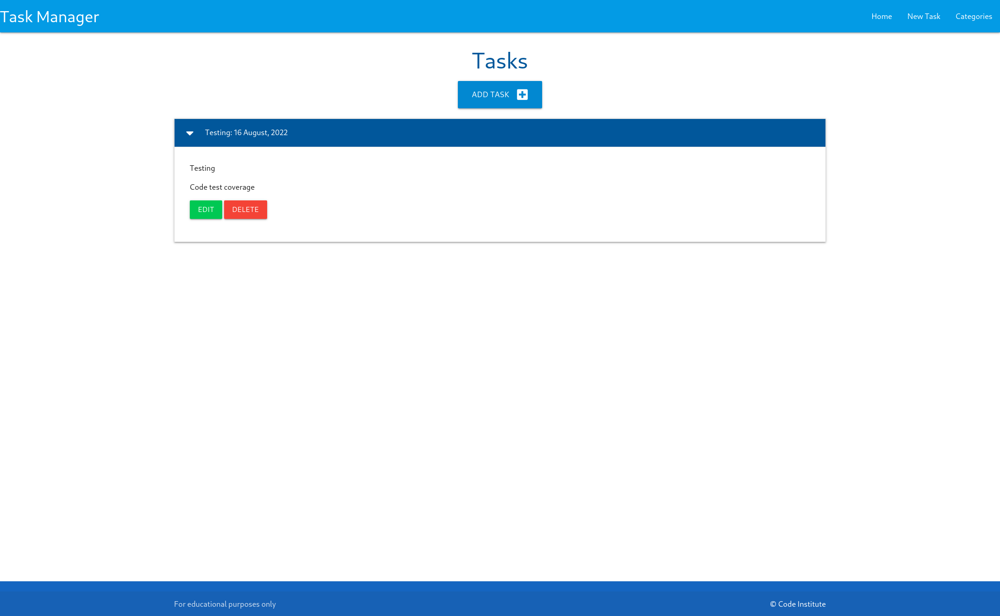
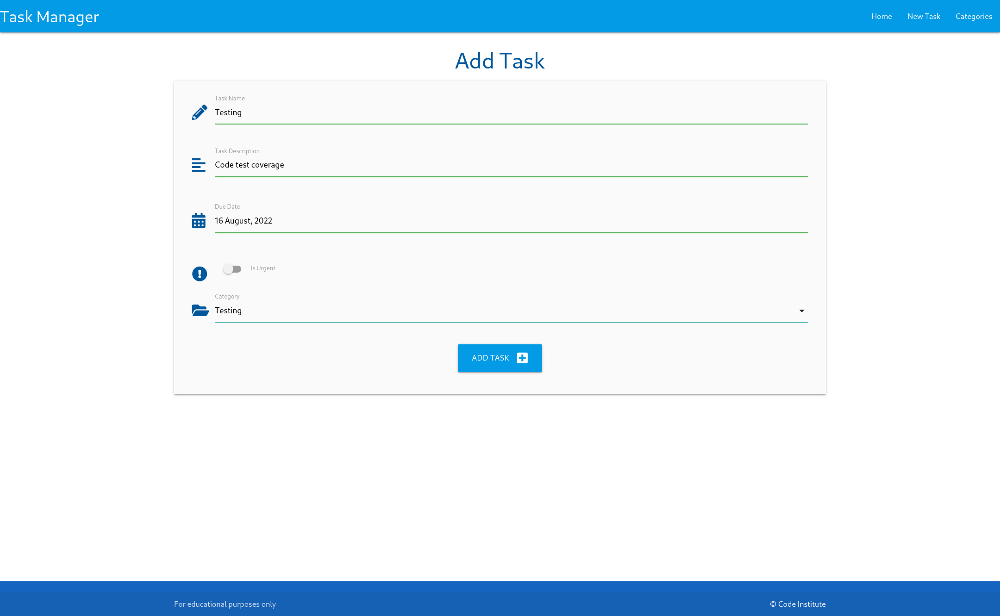
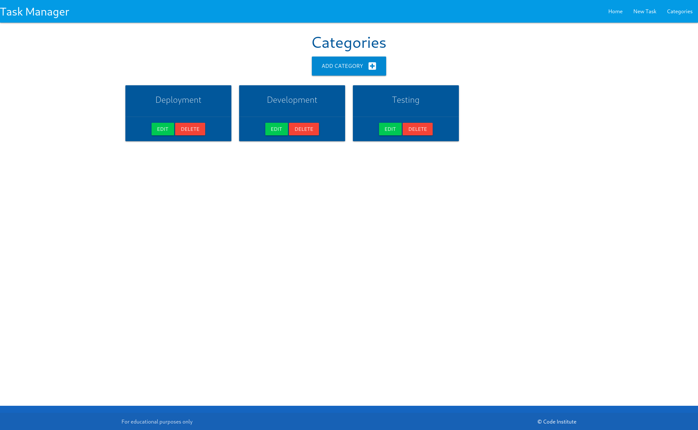

# Task manager

Task manager is built using Flask, the SLQAlchemy ORM, and Materialize frontend framework.
For the Learning Outcomes, we learned how to perform full CRUD functionality, which
allows us to create, read, update, and delete items on our database.
This is done in the context of a Flask application.
We also created HTML-based user interfaces to demonstrate these CRUD calls in action.

# Technologies used
* Flask 
* SQLAlchemy
* HTML5
* Materialize framework
* PostgreSQL


# Initial setup

My Dev enviroment is quite different from Code Institute so I couldn't follow the instructions.

As a main OS im using [Fedora Silverblue](https://pages.github.com/) which means all development is done within containers using [Podman](https://podman.io/).

## [Distrobox](https://github.com/89luca89/distrobox)
Simply put it's a fancy wrapper around podman or docker to create and start containers highly integrated with the hosts.

The distrobox environment is based on an OCI image. This image is used to create a container that seamlessly integrates with the rest of the operating system by providing access to the user's home directory, the Wayland and X11 sockets, networking, removable devices (like USB sticks), systemd journal, SSH agent, D-Bus, ulimits, /dev and the udev database, etc...
Image used for development was Fedora 36.

First, create the enviroment with separate /home directory (to avoid polluting host OS with configs) use:

```bash
distrobox create --name image-name --image fedora:36 --home /path/to/folder
```

## Postgres setup

Since you can't run SystemD inside the main dev container, this one liner downloads and runs the Postgres container to attach to (replace CONTAINER-NAME and username):

```bash
podman run --name CONTAINER-NAME -p 5432:5432 -dit -e POSTGRES_HOST_AUTH_METHOD=trust -e POSTGRES_USER=postgresuser -e POSTGRES_PASSWORD=postgres docker.io/postgres:12-alpine
```

If you need manual setup (role or db creation, psql commands, etc), run a bash session inside the container:

```bash
podman exec -it CONTAINERNAME bash
```

After this, start with `podman start CONTAINERNAME` (or `stop` or `restart` or `rm` (if you want to delete and start over)).

Postgres url format:

`DATABASE_URL=postgres://{user}:{password}@{hostname}:{port}/{database-name}`

If you don’t specify the `PGUSER` environment variable, then `psql` will assume you want to use the current OS user as your database user name. In this case, you are using `root` as your OS user, and you will attempt to log in as `root`, but that user doesn’t exist in the database.

You’ll need to either call `psql -U postgres`, or `su - Postgres` first.

### Create database

```sql
CREATE DATABASE taskmanager;
```

### Connect to database, quit psql and exit the container

```sql
\c taskmanager;
\q;
exit
```

Back in the terminal editor lesson moves on to create the tables we previously coded in Python.

Get into python REPL, import db and create tables:

```bash
python3
from taskmanager import db
db.create_all()
exit()
```

- There was an error due to not having the Postgres user on the database, fix provided below
    
    ```bash
    psycopg2.OperationalError: connection to server at "localhost" (::1), port 5432 failed: FATAL: role "postgres" does not exist
    ```
    
    To fix it, simply create a new user named `postgres` (using the user we previously created)v with the option `--superuser` using the `createuser` utility that comes with Postgres. The utility can be found in the Postgres' `bin` directory. e.g.
    
    ```
    createuser -U postgresuser --superuser postgres
    ```
    

To check if the tables were properly created, inside the container type 

```bash
psql -U postgresuser -d taskmanager
taskmanager=# \dt
List of relations
Schema |   Name   | Type  |  Owner
--------+----------+-------+----------
public | category | table | postgres
public | task     | table | postgres
(2 rows)
```

## Demo

https://taskmanager-flask-azelliott.herokuapp.com/

## Screenshots

Home page


Add task


Categories


## Deployment

clone the repository with
```bash 
git clone https://github.com/Azelliott/task-manager
```

* Rename `env_sample.py` to `env.py` and fill out the details.
* Install requirements (Postgres, Flask, SQLAlchemy)
* Run local application with:
```bash
python3 run.py
```